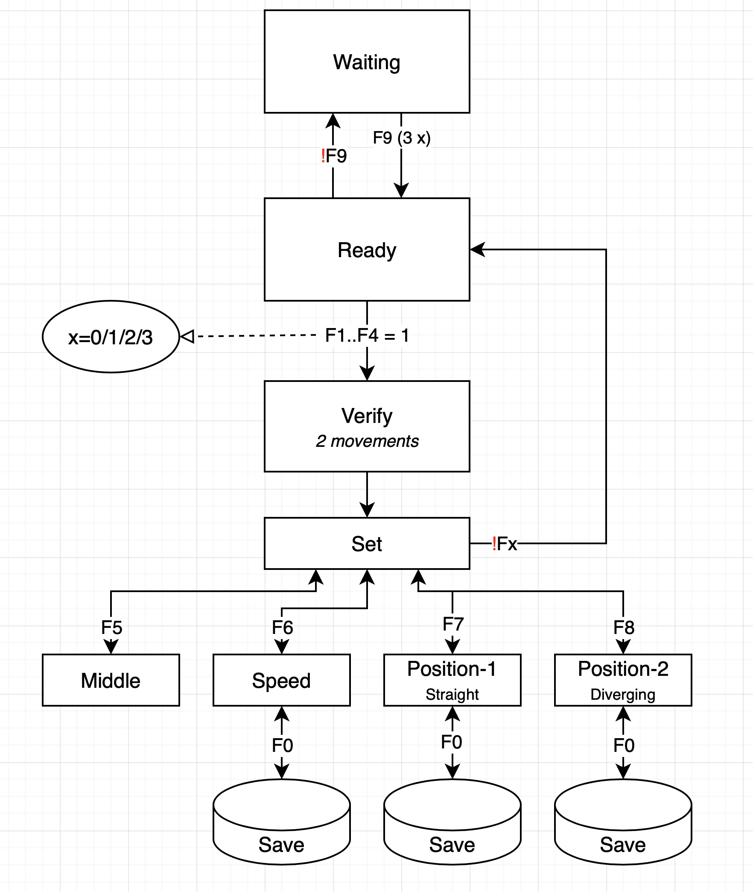

# Setting servo speed and end positions #
Configuration of servo speed and end positions (thresholds) can be performed via a normal DCC handheld. For that purpose, the decoder listens to the loco address: *7000 + Decoder address*.

Example: if the switch address on a Lenz LH100 is in the range of 397..400, the decoder address will be 99 (*400 / 4 - 1*) and the loco address 7099 (*7000 + 99*)). Note that this loco address can also be used for CV configuration via PoM.

The figure above shows the state diagram to configure the servos.

### Enter configuration mode ###
To enter configuration mode, F9 should be pushed tree times on, and two times off, within a period of three seconds.

### Select servo ###
The desired servo is selected via the function keys F1 .. F4. F1 idsfor servo 1, F2 for servo 2 etc. Note that the current software is written for a maximum of 4 servos. It would be relatively simple to extend this number, however.

Deactivating F1..F4 will leave the configuration mode for that servo and allows other servos to be configured.

### Set middle position ###
By activating F5, the servo will move to the middle position (1500 us). Also both threshold values will be set to 1500 us.

### Set servo speed ###
F6 should activated be set the speed at which the servo moves. The default value is 6. Change the loco speed on the handheld to change this speed.

### Threshold 1 (straight) ###
Activate F7 to set threshold 1, which is, in case of switches, for the straight position. If a loco speed is set, the position will slowly change. By increasing the loco speed, the change will be faster. By changing the loco direction, the position will change into the other direction.

### Threshold 2 (diverging) ###
Activate F8 to set threshold 2, which is for the diverging track.

### Store in EEPROM ###
Every time F0 is activated, the current setting will be saved in EEPROM.
