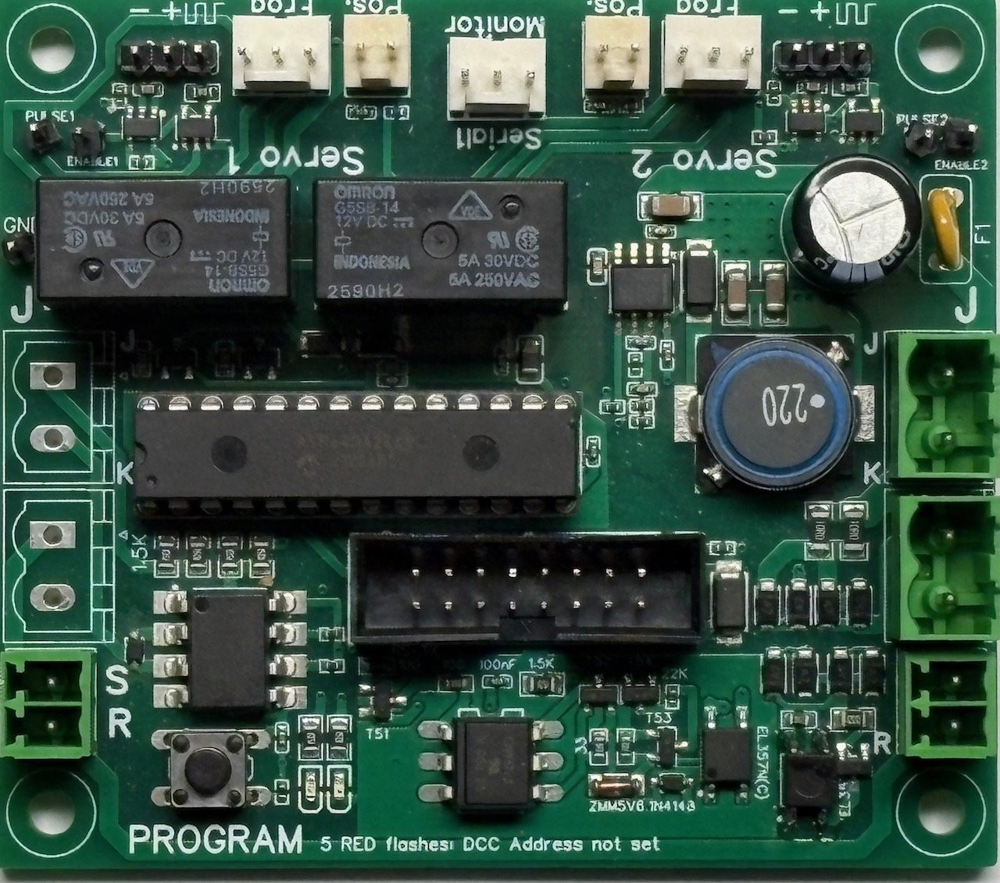

# AVR Servo Decoder #
DCC Servo decoder for boards with the AVR64DA28 processor. For the capabilities of these boards, see the section on [Hardware](#Hardware) below. The main difference between this software and most other (open source) servo software projects, is that this software relies on high quality servo pulse generation, by taking advantage of the powerful peripherals that are exposed by the modern AVR processors. It uses the [Servo-TCA library](https://github.com/aikopras/Servo-TCA) for this purpose.

### Basic operation ###
The servo decoder decoder listens to DCC (Digital Command Control) accessory commands and is able to switch two or more servos (the number of supported servos depends on the specific board, and can be changed using a #define).

The accessory address at which the decoder is listening, can be set using the onboard button. After this button is pushed, the decoder will use the first accessory address that is received as its own address. Pushing the button for 5 seconds will reset all CV values and delete the decoder address.

### Setting servo speed and end positions ###
The end positions and the speed at which the servo moves, can be configured in two different ways. The first and easiest way is to use [a handheld](extras/EndPositions.md) for running trains. The second is to use [Configuration Variables](extras/ConfigurationVariables.md) (CVs).

### Selecting curves ###
Servo movements will follow the [curves](https://github.com/aikopras/Servo-TCA/blob/main/extras/Curves/curves.md) that are defined by the Servo-TCA library. Which curvo will be used, can be determined by setting the corresponding CV. The default curve is Move-A.
.

### CVs ###
For the list of CVs and their meaning, see the [dedicated page](extras/ConfigurationVariables.md).

### RS-Bus feedback ###
The servo decoder is able to send feedback information via the (Lenz) RS-Bus. The RS-Bus address matches the DCC decoder address (which is switch address / 4), and is therefore set in conjunction with the DCC address.

In addition to sending feedbacks, this RS-Bus can also be used for reading CV values via PoM messages (RS-Bus address 128).

### Software ###
The servo decoder software is written for the Arduino IDE with the [DxCore](https://github.com/SpenceKonde/DxCore) board definitions. The software requires the use of the [AP_DCC_Decoder_Core library](https://github.com/aikopras/AP_DCC_Decoder_Core), as well as the [Servo-TCA](https://github.com/aikopras/Servo-TCA) library.

##### UPDI #####
The software can be flashed via UPDI. For that purpose, two UPDI pins are  available from the 16-Pin IDC connector. See the [instructions on the DxCore website](https://github.com/SpenceKonde/DxCore?tab=readme-ov-file#from-a-usb-serial-adapter-with-serialupdi-pyupdi-style---recommended) for details.

### Hardware ###
The software runs on the servo-2 decoder board with a AVR64DA28 processor. The design of this board is open source, and it can be found on [OSHWLAB](https://oshwlab.com/aikopras/support-lift-controller_copy_copy_copy_copy). From there it can be imported into EasyEda and ordered at JLCPCB. The AVR64DA28 processor is a THT component, and can be ordered from companies such as Mouser.

This decoder board includes two relays that can be used to switch the polarity of frogs, as well as connectors for external buttons to switch the servos without the use of DCC.

A variant of this is being planned, which eventually will also be made available via OSHWLAB. That board will support up to 3 servos, which is useful in combination with [Weinerts Mein Gleis DKW](https://www.h0-modellbahnforum.de/t321561f54854-RE-Weinert-Modellbau-raquo-mein-Gleis-laquo-23.html#msg3864004). That board will not have onboard relays, but instead a connector to connect standard AliExpress Relay boards.

### External links ####
- Schematics and PCB: https://oshwlab.com/aikopras/support-lift-controller_copy_copy_copy_copy (sorry for this strange URL)
- Servo-TCA library: https://github.com/aikopras/Servo-TCA
- AP_DCC_Decoder_Core library: https://github.com/aikopras/AP_DCC_Decoder_Core
- DxCore board definitions: https://github.com/SpenceKonde/DxCore
- UPDI programming using a serial interface: https://github.com/SpenceKonde/DxCore?tab=readme-ov-file#from-a-usb-serial-adapter-with-serialupdi-pyupdi-style---recommended
- AVR64DA28 Datasheet: https://ww1.microchip.com/downloads/aemDocuments/documents/MCU08/ProductDocuments/DataSheets/AVR64DA28-32-48-64-DataSheet-DS40002233.pdf
