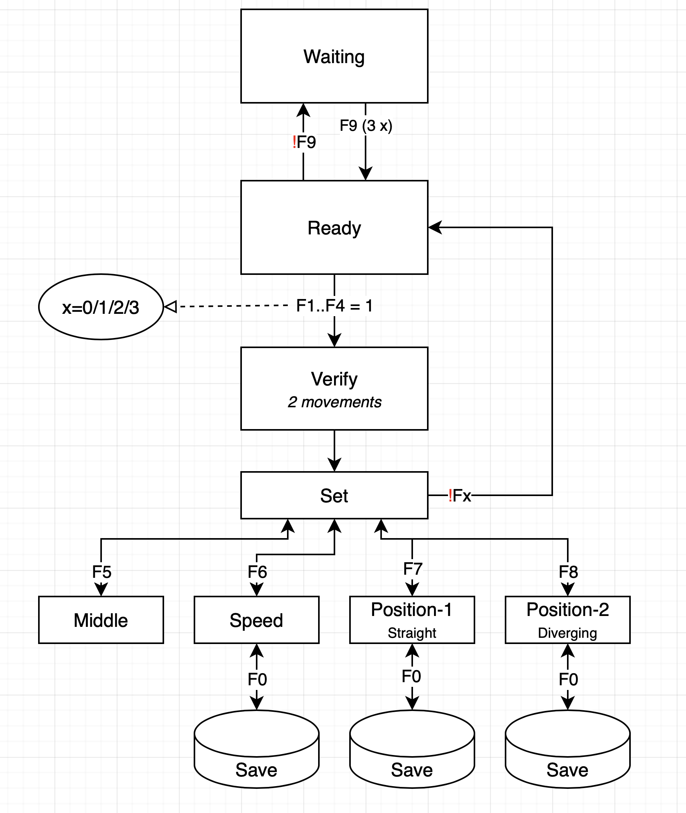

# AVR-Servo-2
DCC Servo decoder for the AVR64DA28 Servo board, supporting two servos

### Basic operation ###
The servo decoder decoder listens to DCC (Digital Command Control) accessory commands and is able to switch two servos. These servos can also be switched via the two buttons that can be connected to the board.

The accessory address that the decoder is listening to, can be set using the onboard button. After this button is pushed, the decoder will use the first accessory address that is received as its own address.

The decoder board includes two relays that can switch the polarity of frog.

### Setting servo speed and end positions ###
Configuration of servo speed and end positions (tresholds) can be performed via a normal DCC handheld. For that purpose, the decoder listens to the loco address: *7000 + Decoder address*.

Example: if the switch address on a Lenz LH100 is in the range of 397..400, the decoder address will be 99 (*400 / 4 - 1*) and the loco address 7099 (*7000 + 99*)). Note that this loco address can also be used for CV configuration via PoM.

The figure above shows the state diagram to configure the servos.
To enter configuration mode, F9 should be pushed tree times on, and two times off, within a period of three seconds.

// - F9: enter / leave configuration mode
// - F1 .. F4: select servo 1 ..4
// - F5: Set servo in middle position, as well as both tresholds (1500 us).
// - F6: Set sevo speed (default = 6)
// - F7: Set treshold 1 (straight)
// - F8: Set treshold 2 (diverging)
// - F0: store current setting in EEPROM (while in F6, F7 or F8)

Links to further information:
- [Details of the decoder's operation](extras/Description.md#Description)
- [Used addresses and configuration](extras/Addresses.md#Addresses)
- [Alternatives to stop trains](extras/HowToStop.md#HowToStop)

### Compatible DCC systems ###
The safety decoder was specifically designed for a LENZ (LZV100 / LV102). The decoder is able to send RS-Bus messages, and the relay can  connect the LZV100 master station to the LV102 boosters.

The watchdog function of the safety decoder can be used with all DCC systems that allow interruption of the signal between command station and booster. It *might* also work with integrated systems, provided such a system has an external emergency stop connector, to which the relay can be connected.

### Software ###
The servo decoder software is written for the Arduino IDE. The software requires the use of the AP_DCC_Decoder_Core: https://github.com/aikopras/AP_DCC_Decoder_Core, as well as the Servo-TCA library: https://github.com/aikopras/Servo-TCA.

### Hardware ###
The software runs on the safety decoder board, as can be found on: https://oshwlab.com/aikopras/watchdog-decoder. The board design is open source, and can be copied using the (free / web-based) EasyEda PCB design program. After loading it into EasyEda, it can be ordered at JLCPCB for a few Euro's.

